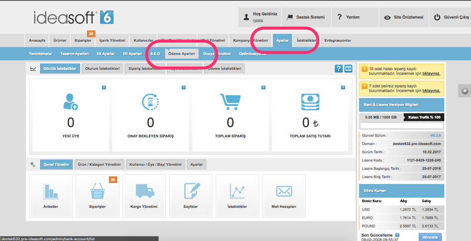
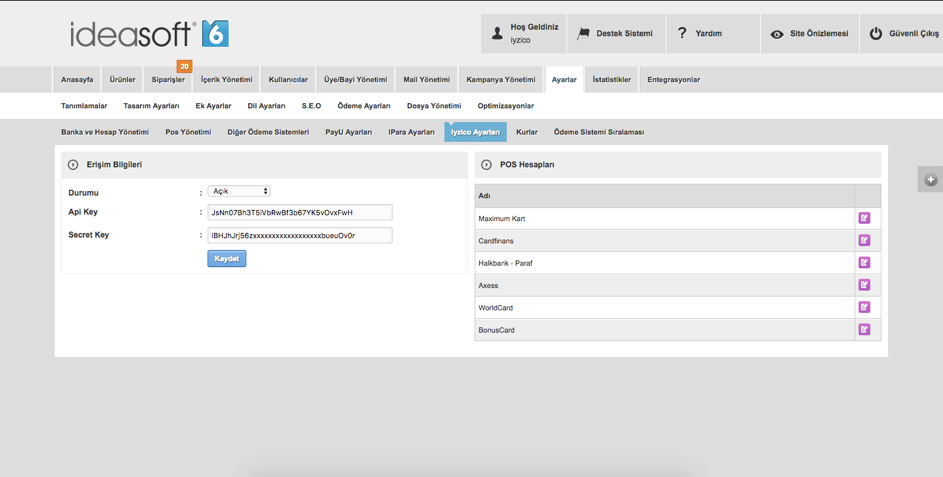
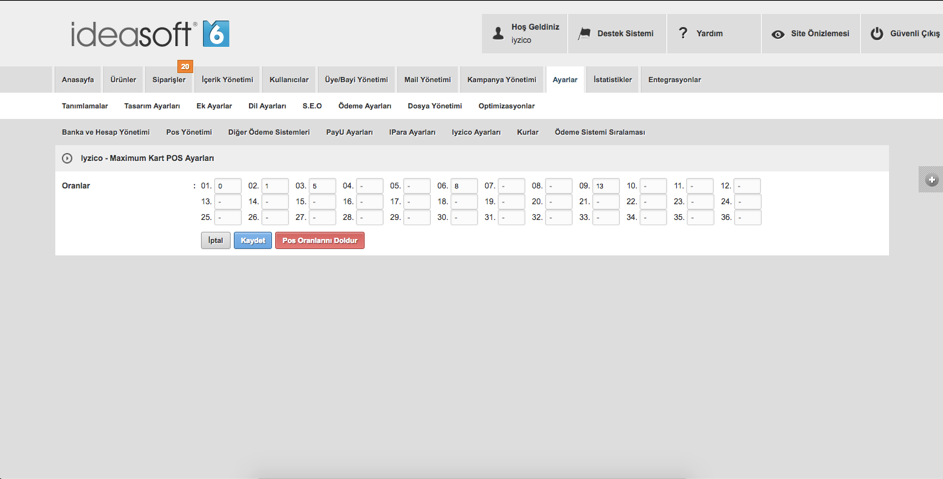

# Ideasoft


iyzico entegrasyon sürecini sizler için daha anlaşılabilir ve kolay kılmak için bir entegrasyon rehberi hazırladık.

Rehberde yanıt bulamadığınız ve de anlaşılır gelmeyen konularla ilgili bize  entegrasyon@iyzico.com adresi üzerinden ulaşabilirsiniz, sizlere yardımcı olmaktan mutluluk duyarız.

1. **Api anahtaraları :** Siteniz üzerinde iyzico ile bağlantı kurmanız için gerekli olan anahtarlardır.
2. **Sitenizin altyapısı :** Sitenizin altyapısına uygun modülümüzü indirerek entegrasyonu gerçekleştirmelisiniz.
3. **Entegrasyon testleri :** Ödeme sisteminin sitenizde sağlıklı şekilde çalıştığından emin olmak için gerekli olan en temel testlerdir.

### **Api Anahtarı ve Güvenlik Anahtarı** 

"API Anahtarı" ve "Güvenlik Anahtarı" bilgilerine iyzico panelinize [https://merchant.iyzipay.com/login](https://merchant.iyzipay.com/login) adresinden girerek,  Ayarlar menüsünden ulaşabilirsiniz.

Api anahtarlarınız iyzico ile bağlantı kurmanızı sağlayan temel değerlerdi

### **Site Altyapısı**

 “Api Anahtarı" ve "Güvenlik Anahtarı" bilgilerinizi sitenizin yönetici panelinde, iyzico ayarları kısmında, ilgili bölüme giriniz. Bu konuda altyapı sağlayıcınızdan destek alabilir, aşağıdaki adımları takip ederek entegrasyonu gerçekleştirebilirsiniz.

Ek olarak Ideasoft tarafından hazırlanmış 

[https://www.ideasoft.com.tr/konu/odeme-ayarlari/iyzico-sanal-pos-kurulumu](https://www.ideasoft.com.tr/konu/odeme-ayarlari/iyzico-sanal-pos-kurulumu)

adresindeki dökümanı inceleyebilirsiniz.

**Adım 1.**

Ideasoft yönetici panelinizde **Ayarlar-&gt;Ödeme Ayarları** kısmından ödeme ayarları bölümüne ulaşınız

**Adım 2.**

Ödeme ayarları içerisinden **iyzico Ayarları**’nı seçiniz. Eğer ödeme ayarları satırında iyzico Ayarları bulunmuyor ise ideasoft destek ekibi ile iletişime geçerek \([https://www.ideasoft.com.tr/sayfa/iletisim](https://www.ideasoft.com.tr/sayfa/iletisim)\) iyzico ayarlarının aktif edilmesini sağlayabilirsiniz.

**Adım 3.**

iyzico Ayarları bölümünde, “Durumu” seçeneğini açık olarak işaretleyin.

“Api Key” bölümüne Api Anahtarınızı girin.

“Secret Key” bölümüne güvenlik anahtarınızı girin.

“Kaydet” butonuna basın.

**Adım 4.**

iyzico Ayarları bölümünde sağ taraftaki kart markalarının \(ör: Maksimum Kart\) düzenleme butonuna tıklayın. Ardından “Pos Oranlarını Doldur” butonuna tıklayıp kaydedin.

Bu işlem, ürünlerinizin açıklamasında bulunan taksit seçenleri kısmı için gereklidir. Iyzico’da 2-3-6-9 ve 12 taksit seçenekleri bulunmaktadır. “Pos Oranlarını Doldur” butonuna tıkladığınızda bu taksitlerden hesabınızda aktif olanlar otamatik olarak yüklenecektir.


Artık siteniz ödeme almak için hazır


### **Entegrasyon Testleri**

-Ödeme \(başarılı ve başarısız\)

-3ds ödeme

-3ds ödemede, 3ds ekranında vazgeç butonuna basmak

-Taksitli ödeme \(sepette taksite izin olmayan bir ürün var ise taksit seçeneklerinin görüntülenmemesi\)

-Sepette birden fazla ürün ile ödeme

Yaptığınız test işlemlerini iyzico kontrol panelinizden kontrol etmeyi unutmayın.

Tüm ödeme işlemlerinizi iyzico panelinizden anında iptal edebilirsiniz.

