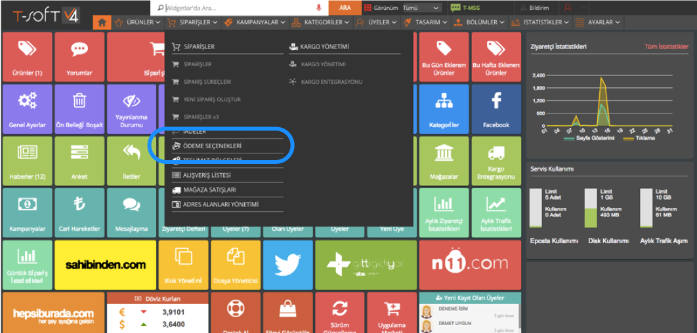
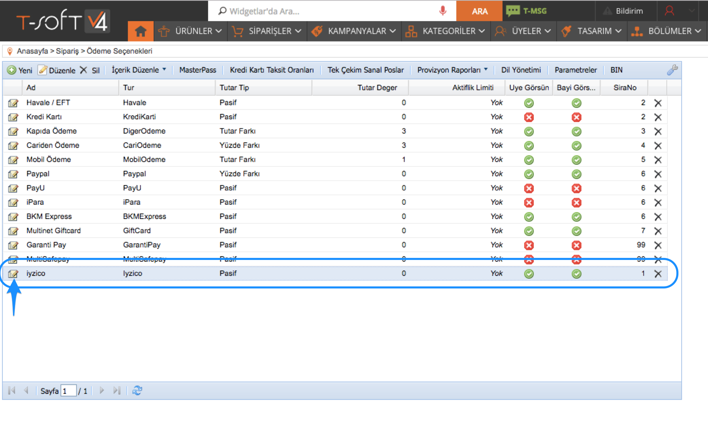
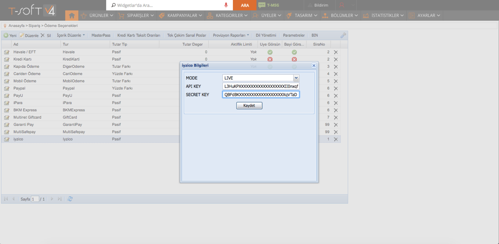
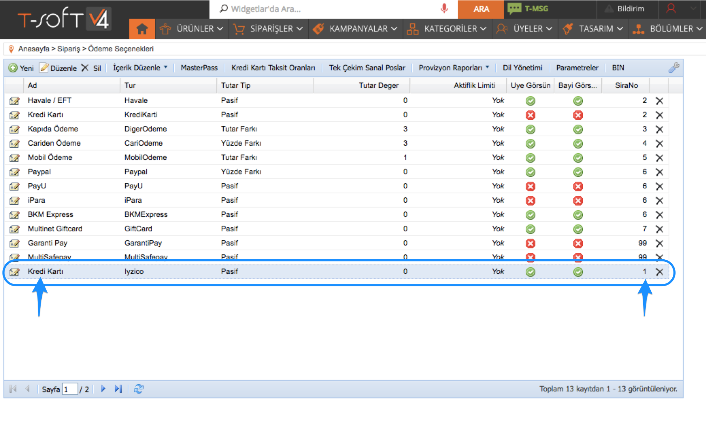

# Tsoft

iyzico entegrasyon sürecini sizler için daha anlaşılabilir ve kolay kılmak için bir entegrasyon rehberi hazırladık.

Rehberde yanıt bulamadığınız ve de anlaşılır gelmeyen konularla ilgili bize entegrasyon@iyzico.com adresi üzerinden ulaşabilirsiniz, sizlere yardımcı olmaktan mutluluk duyarız.

1. **Api anahtaraları :** Siteniz üzerinde iyzico ile bağlantı kurmanız için gerekli olan anahtarlardır.
2. **Sitenizin altyapısı :** Sitenizin altyapısına uygun modülümüzü indirerek entegrasyonu gerçekleştirmelisiniz.
3. **Entegrasyon testleri :** Ödeme sisteminin sitenizde sağlıklı şekilde çalıştığından emin olmak için gerekli olan en temel testlerdir.

### **Api Anahtarı ve Güvenlik Anahtarı** {#api-anahtari-ve-guevenlik-anahtari}

"API Anahtarı" ve "Güvenlik Anahtarı" bilgilerine iyzico panelinize [https://merchant.iyzipay.com/login](https://merchant.iyzipay.com/login) adresinden girerek, Ayarlar menüsünden ulaşabilirsiniz.

Api anahtarlarınız iyzico ile bağlantı kurmanızı sağlayan temel değerlerdir.

### **Site Altyapısı** {#site-altyapisi}

“Api Anahtarı" ve "Güvenlik Anahtarı" bilgilerinizi sitenizin yönetici panelinde, iyzico ayarları kısmında, ilgili bölüme giriniz. Bu konuda altyapı sağlayıcınızdan destek alabilir, aşağıdaki adımları takip ederek entegrasyonu gerçekleştirebilirsiniz.

**Adım 1 :**

T-soft panelinizde **Siparişler-&gt;Ödeme Seçenekleri** kısmına tıklayarak iyzico ayarlarının olduğu kısma ulaşabilirsiniz.

**Adım 2 :**

Ödeme Seçenkleri sayfasında “iyzico” seçeneğinin yanındaki düzenle butonuna bastığınızda, iyzico api anahtarlarınızı girmeniz için gerekli alan açılır. \(Eğer iyzico seçeneği bulunmuyor ise T-soft destek ekibi ile iletişime geçerek, iyzico seçeneğinin sitenizde aktif olmasını sağlayabilirsiniz\)

**Adım 3 :**

Mode kısmını “LIVE” seçip api anahtarlarınızı girerek “kaydet” butonuna basınız.

**Adım 4 :**

iyzico yazısının üzerine çift tıklayarak dilerseniz, ödeme sayfanızda görünecek ismi “Kredi Kartı” olarak değiştirebilir, ek olarak ödeme sayfanızdaki sıralamasını da “sıra no” kısmından değiştirebilirsiniz.


Artık siteniz ödeme almak için hazır.


### **Entegrasyon Testleri**

-Ödeme \(başarılı ve başarısız\)

-3ds ödeme

-3ds ödemede, 3ds ekranında vazgeç butonuna basmak

-Taksitli ödeme \(sepette taksite izin olmayan bir ürün var ise taksit seçeneklerinin görüntülenmemesi\)

-Sepette birden fazla ürün ile ödeme

Yaptığınız test işlemlerini iyzico kontrol panelinizden kontrol etmeyi unutmayın.

Tüm ödeme işlemlerinizi iyzico panelinizden anında iptal edebilirsiniz.

