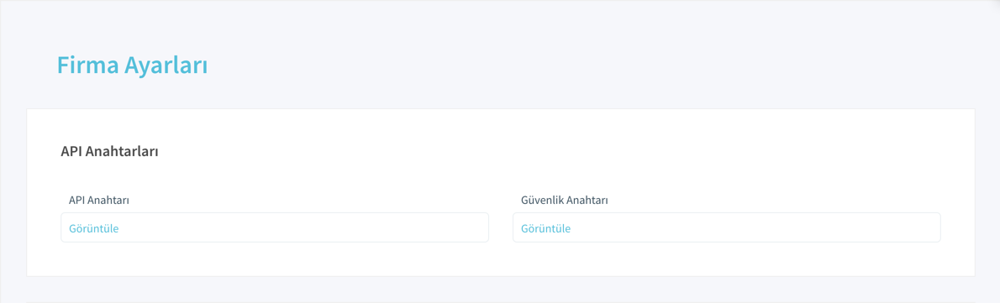
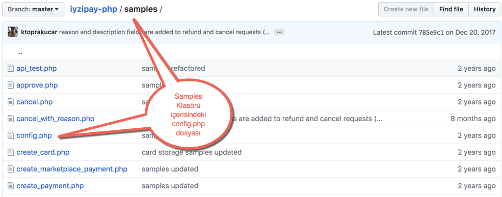
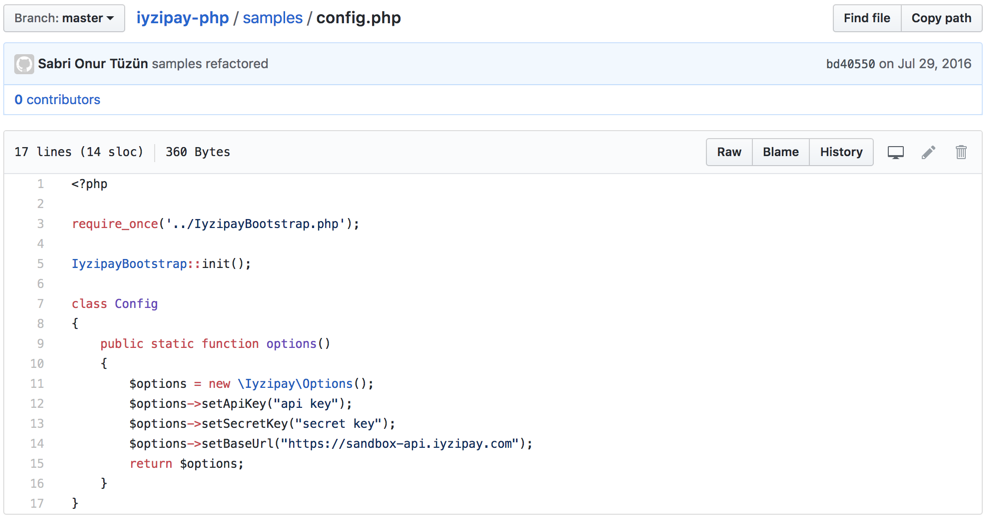

# Ödeme Formu

## Başlangıç

Hazırladığımız bu rehber ile birlikte iyzico ödeme formunu hızlı bir şekilde entegre edebilirsiniz.

1. API ve Güvenlik anahtarınızı doğru `baseUrl` ile kullanın.
2. Ödeme formunu başlatmak için ilgili kütüphanedeki `CreateCheckoutFormInitializeRequest` sorgusunu çalıştırın ve `checkoutFormContent` alanında dönen scripti formun gösterilmesini istediğiniz sayfada kullanın.
3. Ödeme formunu göstermek için dönen scriptin bulunduğu sayfaya aşağıdaki html etiketlerini ekleyin. `<div id="iyzipay-checkout-form" class="responsive"></div>`
4. Yapılan ödemenin sonucunu öğrenmek için `RetrieveCheckoutFormRequest` sorgusunu 2. adımdaki istekte gönderdiğiniz `CallbackUrl` adresine **POST** edilen token değeri kullanınız.

## 1- API ve Güvenlik anahtarı kullanımı

Canlı \(Gerçek\) veya Sandbox \(Test\) ortamınız için iyzico panelinize giriş yaptıkdan sonra  "**Ayarlar -&gt; Firma Ayarları**" menüsüne tıklayınız. 



API ve Güvenlik anahtarlarınızı bu sayfada görüntüleyebilirsiniz. Eğer görüntüleyemiyor iseniz başvuru durumunuz hakkında `destek@iyzico.com`mail adresinden bilgi alabilirsiniz.




Bu anahtarları kullandığınız iyzipay kütüphanesinin içerisindeki **config.php** dosyasına kopyalayınız.




Eğer **Sandbox** yani **test** ortamını kullanmak istiyor iseniz **sandbox-** uzantısı ile başlayan API ve Güvenlik anahtarı `https://sandbox-api.iyzipay.com` baseUrl değeri ile kullanmalısınız. 





Eğer **Canlı** yani **gerçek** ortamı kullanmak istiyor iseniz  API ve Güvenlik anahtarını `https://api.iyzipay.com/` baseUrl değeri ile kullanmalısınız.


## 2- Ödeme formunu başlatmak

iyzico kütüphanelerinin içerisinde bulunan sample klasöründen **initialize\_checkout\_form** sayfasını çalıştırabilirsiniz. 



CreateCheckoutFormInitializeRequest





















```

```





## 3- Ödeme formunu göstermek

## 4- Ödeme sonucunu öğrenmek

## 5- Entegrasyon Testleri

## 6- Tebrikler !

## Sonraki adımlar

iyzico'ya yapılan sorgu ile ödeme formu scripti alınarak, iyzico ödeme formu müşteriye gösterilir. Bu servis ile ilgili detaylı bilgiyi aşağıdaki linkten ulaşabileceğiniz ödeme formu başlatma sayfasından edinebilirsiniz.



### \*\*\*\*

Kart sahibi ödeme formu üzerinde ödemesini tamamladıktan sonra, otomatik olarak sonuç sayfasına yönlenir. Bu aşama iyzico tarafından sonuç sayfasına iletilen **"token"** ile ikinci bir sorgu yapılarak ödeme sonucu hakkında ayrıntılı bilgi alınır. Bu servis ile ilgili detaylı bilgiyi aşağıdaki linkten ulaşabileceğiniz ödeme formu sonucu sayfasından edinebilirsiniz.



### Ödeme Formu Entegrasyon Örneği Videosu

{% embed data="{\"url\":\"https://youtu.be/UzQkrztEMgs\",\"type\":\"video\",\"title\":\"iyzico - Ödeme Formu Entegrasyon Örneği\",\"description\":\"iyzico Ödeme Formu entegrasyonu için hazırladığımız demo çalışmasında iyzipay PHP clientı kullanılarak bir örnek yapılmıştır. iyzico Ödeme Formu entegrasyonu ile hızlı ve kolay bir şekilde ödeme almaya başlayabilirsiniz!\\n\\nSorularınızla ilgili Entegrasyon ekibimize entegrasyon@iyzico.com adresinden ulaşabilirsiniz.\\n\\nhttps://www.iyzico.com/\\nhttps://dev.iyzipay.com/tr\\n\\n\\nBizi takip edin!\\n\\nTwitter: https://twitter.com/iyzico\_com\\nFacebook: https://www.facebook.com/iyzico/\",\"icon\":{\"type\":\"icon\",\"url\":\"https://www.youtube.com/yts/img/favicon\_144-vfliLAfaB.png\",\"width\":144,\"height\":144,\"aspectRatio\":1},\"thumbnail\":{\"type\":\"thumbnail\",\"url\":\"https://i.ytimg.com/vi/UzQkrztEMgs/maxresdefault.jpg\",\"width\":1280,\"height\":720,\"aspectRatio\":0.5625},\"embed\":{\"type\":\"player\",\"url\":\"https://www.youtube.com/embed/UzQkrztEMgs?rel=0&showinfo=0\",\"html\":\"<div style=\\\"left: 0; width: 100%; height: 0; position: relative; padding-bottom: 56.2493%;\\\"><iframe src=\\\"https://www.youtube.com/embed/UzQkrztEMgs?rel=0&amp;showinfo=0\\\" style=\\\"border: 0; top: 0; left: 0; width: 100%; height: 100%; position: absolute;\\\" allowfullscreen scrolling=\\\"no\\\"></iframe></div>\",\"aspectRatio\":1.7778}}" %}

